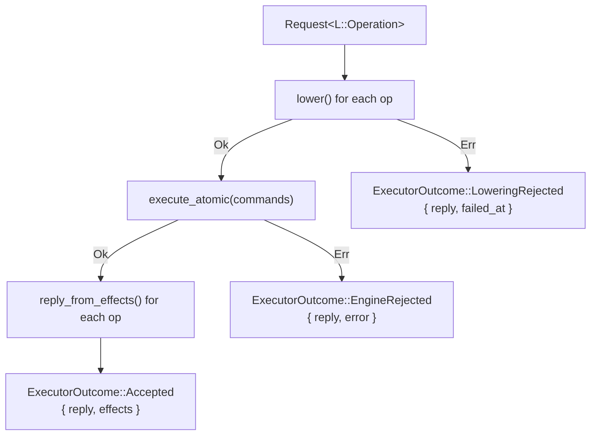
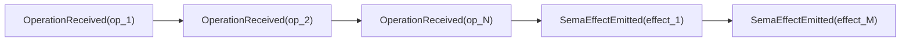
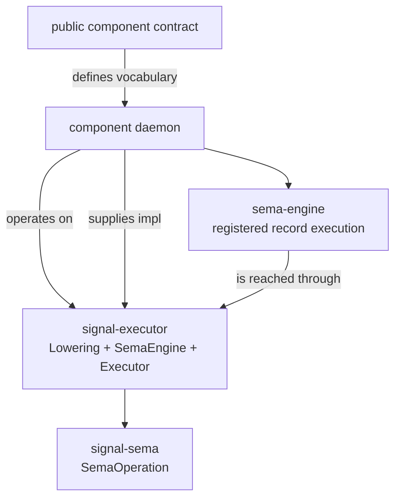

## signal-executor Architecture

`signal-executor` owns the shared library a triad daemon uses to
translate its public contract operations into executable Sema commands,
commit them atomically through a `SemaEngine`, correlate each
Sema effect back to a per-operation reply, and publish operation /
effect events to subscribed observers.

It is below the daemon and above `signal-sema`. The daemon supplies
two impls: a `Lowering` over its contract operation enum, and a
`SemaEngine` over its concrete database backend. The executor
composes those two impls into a uniform `execute(Request) ->
ExecutorOutcome` pipeline.

Public contracts speak contract-local verbs. Lowering is the daemon's
boundary from that public vocabulary into commands its Sema engine can
execute. `signal-sema::SemaOperation` remains the shared operation
class vocabulary for effects and observation; it is not the executable
command shape.

## Constraints

- `signal-executor` is a Rust library crate.
- `signal-executor` contains no daemon, actor, socket, redb, or
  runtime code.
- `signal-executor` contains no Persona-specific, Criome-specific,
  or component-specific payload records. Every contract-level
  vocabulary is supplied by the daemon's `Lowering` impl.
- `signal-executor` depends on `signal-frame` (for `Request`,
  `Reply`, `SubReply`, `AcceptedOutcome`, `NonEmpty`,
  `RequestRejectionReason`, `RequestPayload`) and on `signal-sema`
  (for `SemaOperation` effect classification). It does not depend on
  `sema-engine` the engine; daemons reach their actual engine through
  the `SemaEngine` trait this crate defines.
- The crate is synchronous. Daemons that drive the executor wire it
  into whatever async runtime they already use.
- Public types and methods carry typed errors via `thiserror` per
  `~/primary/skills/rust/errors.md`.
- Type names inside the crate do not restate the `Executor` or
  `Signal` namespace; the domain is implicit.

## Public surface

| Item | Shape | Use |
|---|---|---|
| `Lowering` | trait | per-daemon contract-to-command bridge; three associated types (`Operation`, `Reply`, `Command`) and two methods (`lower`, `reply_from_effects`). |
| `SemaEngine` | trait | atomic commit point with two associated types (`Command`, `Error`) and one method (`execute_atomic`). |
| `Executor<L, S>` | struct | composes `L: Lowering` and `S: SemaEngine` over a shared `ObserverSet`; exposes `execute(Request<L::Operation>) -> ExecutorOutcome<L, S>`. |
| `ExecutorOutcome<L, S>` | enum | three terminal variants: `Accepted { reply, effects }`, `LoweringRejected { reply, failed_at }`, `EngineRejected { reply, error }`. Borrow `reply()` for the wire shape; `is_accepted()` / `is_rejected()` for branching. |
| `SemaEffect` | struct | what happened after an executable command committed: broad `operation: SemaOperation` plus `outcome: SemaEffectOutcome`. |
| `SemaEffectOutcome` | enum | closed variant set keyed off operation class: `Wrote { rows_written, rows_matched }`, `Read { rows_read }`, `Stream { subscription_token }`, `Validated { predicate_held }`. |
| `ObserverChannel<Operation>` | trait | per-channel publish surface the executor calls. Two methods: `publish_operation_received(&Operation)` and `publish_sema_effect_emitted(&SemaEffect)`. |
| `ObserverSet<Operation>` | struct | concrete observer bookkeeping wrapping an `ObserverChannel` in `Arc`; clones share the underlying channel. `ObserverSet::no_op()` for daemons that have not yet wired observation. |
| `RecordingChannel<Operation>` | struct | test-only `ObserverChannel` impl recording events into an internal log for assertion. |
| `RecordedEvent<Operation>` | enum | `OperationReceived(Operation)` / `SemaEffectEmitted(SemaEffect)`. |
| `Error` | enum | crate-boundary structural errors (currently one variant, `EmptyRequest`; reserved for input shape checks). |

## Atomicity contract

`SemaEngine::execute_atomic` is the **single binding point** for
state effects. The trait guarantees:

- either every command in the input `Vec<Self::Command>` commits,
  in which case the engine returns one `SemaEffect` per command
  in request order, or
- no operation commits, and the engine returns `Err(Self::Error)`.

There is no partial-commit return shape. Daemons that need
partial-commit semantics split the work across separate
`Executor::execute` calls -- atomicity is structural per call.

The executor does not retry, does not rollback, does not compensate.
It is the engine's job to enforce all-or-nothing. The executor's
contribution is structural: by funnelling every operation through
one `execute_atomic` call, it makes "all" or "none" the only two
states the caller sees.

When `execute_atomic` returns `Err`, the wire `Reply` is
`Reply::Rejected { reason: RequestRejectionReason::Internal }`. The
engine's typed error is carried separately on the daemon side via
`ExecutorOutcome::EngineRejected { error, .. }`.

## Failure-mode taxonomy

Three terminal paths, one terminal variant per path:



| Path | When | Wire `Reply` | Daemon-side carry |
|---|---|---|---|
| `Accepted` | Every operation lowered and the engine committed atomically. | `Reply::Accepted { outcome: Completed, per_operation: NonEmpty<SubReply::Ok { payload }> }`. | `effects: Vec<SemaEffect>` for post-execution use (logs, metrics, derived events). |
| `LoweringRejected` | A `Lowering::lower` call returned `Err(reply)`. The engine was not called; no state effect occurred. | `Reply::Accepted { outcome: Aborted { failed_at, reason: DomainRejection }, per_operation: ... }`; earlier operations are `Invalidated`, the failed operation carries `SubReply::Failed { detail: Some(reply) }`, later operations are `Skipped`. | `failed_at` -- the index of the domain-rejected operation. |
| `EngineRejected` | `SemaEngine::execute_atomic` returned `Err`. No state effect committed (atomicity contract). | `Reply::Rejected { reason: RequestRejectionReason::Internal }`. | `error: S::Error` -- the engine's typed failure cause. |

Post-commit publication failures (the observer set's
`publish_*` methods) do **not** roll back state. By the time the
executor reaches the publication step, the engine has already
committed. A panicking observer is a daemon-side bug; the wire
reply is unaffected.

## Reply correlation

`Lowering::reply_from_effects` is called once per operation, in
request order, with the full effects slice. The impl is responsible
for selecting which effects correspond to which operation -- typically
by counting forward through the slice in the order `lower` produced
operations.

The executor preserves request order:

1. The input `Request<L::Operation>` carries `NonEmpty<L::Operation>`.
   The executor iterates `payloads()` in request order to call
   `lower` and `reply_from_effects` -- never re-orders.
2. The output `Reply::Accepted` carries
   `NonEmpty<SubReply<L::Reply>>`. The executor builds it from the
   `(head_op, tail_ops)` split of the input non-empty, preserving
   non-emptiness without re-checking shape.

A `Lowering` impl that produces an empty `Vec` for one operation
(legitimate for validation-only or no-op operations) still
participates in `reply_from_effects` -- it just consults the
effects slice without claiming any of it.

## Observer publication ordering

The executor publishes in fixed order:

1. **OperationReceived** fires for every payload in the request,
   in request order, **before** any `lower` call.
2. **SemaEffectEmitted** fires for every effect, in commit order,
   **after** the engine returns successfully.

This is a hard ordering. Tests in `tests/round_trip.rs` witness it
via a `RecordingChannel`.

On lowering rejection, every operation up to (and including) the
rejecting one is observed under `OperationReceived`, but no
`SemaEffectEmitted` fires because no effect was committed.

On engine rejection, every operation is observed, but again no
`SemaEffectEmitted` fires because no effect was committed.



Where:
- N is the number of operations in the request.
- M is the number of effects the engine emitted (commit order).
- N and M may differ -- one operation may lower to many Sema
  operations, or to zero.

## Macro coordination

A parallel work-stream extends `signal-frame`'s `signal_channel!`
macro with an `observable` block that injects publish surfaces and
a subscription stream on the channel. When that work lands, the
macro will emit per-channel functions roughly shaped like:

```rust
fn publish_operation_received(&self, operation: &ChannelOperation);
fn publish_sema_effect_emitted(&self, effect: &SemaEffect);
```

`signal-executor`'s `ObserverChannel<Operation>` trait is designed
so that daemons can adapt the macro's emitted functions to the
trait by writing a thin newtype adapter (one trait impl per
channel). The exact shape of the macro's emitted code will be
reconciled in a follow-up once the macro work lands; today's
`ObserverChannel` trait is the executor-facing half of that
boundary.

## Boundary



`signal-executor` does not see `sema-engine` directly; the daemon
implements `SemaEngine` over its concrete engine instance and
hands the impl to the executor.

## Non-goals

- No public component operation vocabulary.
- No request/reply frame mechanics (those live in `signal-frame`).
- No Sema operation vocabulary or pattern primitives (those live
  in `signal-sema`).
- No `sema-engine` integration. Daemons bridge their engine into
  the `SemaEngine` trait themselves.
- No authentication, routing, or daemon-side policy.
- No async runtime, actor supervision, socket plumbing, or redb
  table management.
- No retry, backoff, or compensation logic. Atomicity is the
  engine's contract; the executor is the structural binding point.

## Code map

```text
src/lib.rs       module entry and re-exports
src/effect.rs    SemaEffect and SemaEffectOutcome with witness predicate
src/engine.rs    SemaEngine trait (associated Command + Error types,
                 execute_atomic)
src/error.rs     crate-boundary Error enum (reserved input-shape variants)
src/executor.rs  Executor struct and ExecutorOutcome enum
src/lowering.rs  Lowering trait (Operation, Reply, Command)
src/observer.rs  ObserverChannel trait, ObserverSet struct,
                 RecordingChannel + RecordedEvent for tests

tests/counter/mod.rs  Counter mock: operation/reply/command enums,
                      Lowering impl, SemaEngine impl (typed commands,
                      canned effects, plus poisoned variant for
                      engine-rejection tests)
tests/effect.rs       Unit tests for SemaEffect::is_write_commit
                      across all operation classes and outcomes
tests/observer.rs     Unit tests for ObserverSet, RecordingChannel,
                      RecordedEvent ordering, and Arc-shared channels
tests/round_trip.rs   End-to-end tests: single-op accepted, multi-op
                      accepted, lowering rejection (engine never
                      called), engine rejection (no state visible),
                      observer publication ordering, empty-lowering,
                      ExecutorOutcome::reply accessor
```

## See also

- `/git/github.com/LiGoldragon/signal-frame/ARCHITECTURE.md`
  -- the frame mechanics this crate consumes (`Request`, `Reply`,
  `NonEmpty`, `RequestPayload`).
- `/git/github.com/LiGoldragon/signal-sema/ARCHITECTURE.md`
  -- the Sema operation vocabulary this crate composes with.
